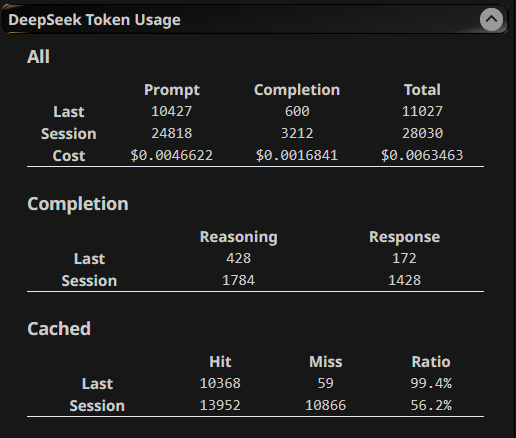

# SillyTavern DeepSeek (Simple) Token Usage (viewer)



## Features

Shows the token usage that is returned by DeepSeek's API in a convenient(-ish) way.

## Installation and Usage

### Installation

Using ST's built in installer

```
https://github.com/0x4kgi/SillyTavern-DeepSeek-Token-Usage
```

### Usage

Just open the extensions tab.

## How it works

This extension overrides the default `window.fetch` method and will only trigger if `/api/backends/chat-completions/generate` is called. 

So it should not interfere with the rest of ST's core features. Probably. 

Please open an issue if this fucks up your SillyTavern installation.

## Prerequisites

Tested on ST 1.18.0. *Might* work on older.

This extension is written with the DeepSeek's API in mind. **Will not work with other APIs** As its currently hardcoded in.

**Use DeepSeek's connection profile! Custom WILL NOT WORK!**

But if I decide to remove this restriction, the streaming response shoule have `usage` field on it: 

```json
"usage": {
  "prompt_tokens": 67,
  "completion_tokens": 67,
  "total_tokens": 67,
  "prompt_tokens_details": {
    "cached_tokens": 67
  },
  "completion_tokens_details": {
    "reasoning_tokens": 67
  },
  "prompt_cache_hit_tokens": 67,
  "prompt_cache_miss_tokens": 67
}
```

## AI Disclosure

Initially vibe coded with Google Gemini.

## Special Thanks

[city-unit's st-extension-example](https://github.com/city-unit/st-extension-example) for the template.

## License

**Unlicense**. Just Because.
